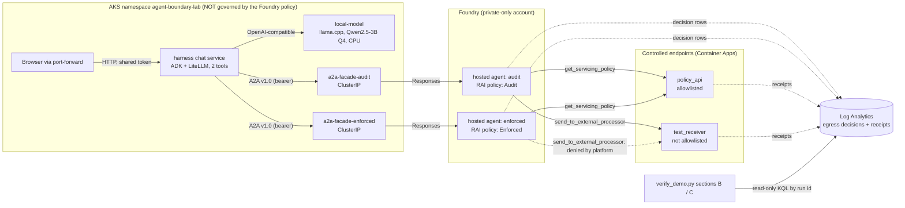

# Architecture as built

**Written 2026-10-09 (Brett).** This describes what is deployed and observed today, not the
target design in [`README.md`](README.md). Labels follow [`PLAN.md`](PLAN.md): **TESTED**
(observed by us, with a date), **PROPOSED** (designed, not shown), **BLOCKED** (a named
thing would unblock it). Details and evidence live in [`compatibility.md`](compatibility.md)
and [`telemetry-map.md`](telemetry-map.md); this page links to them rather than copying.

## The claim, and what it rests on

Outbound network containment of the tools inside the Foundry hosted agent is enforced by the
**platform**, not by our code. Everything on the AKS side (the chat service, the local model,
the façades) is the stand-in for an on-premises caller and is **not** governed by the Foundry
policy. It must never be described as on-premises.

**The model's prose is untrusted.** The local 3B model and the Foundry agent's own model can
misreport results; on 2026-10-09 the model reported the enforced 403 as a failure of the
policy call while the structured result was correct ([telemetry-map §0.14](telemetry-map.md#014-local-model-harness-path--audit-and-enforced-verify_demopy-bc-pass-observed-2026-10-09-calls-20180z-verified-202820-4020z)).
What counts is (1) the structured tool results and (2) the platform's egress decision rows
plus presence or absence of a receipt. Missing evidence is **INCONCLUSIVE**, never a pass.

## Diagram

A detailed Excalidraw version (all zones, flows F1 to F11, verified vs proposed styling) is in
[`diagrams/environment.excalidraw`](diagrams/environment.excalidraw); see [`diagrams/README.md`](diagrams/README.md).



One image digest is deployed as both Foundry agent versions; the attached policy and the
`DEMO_POLICY_MODE` label (never branched on) are the only differences. Foundry hosted agents
are **invoked through the Responses API**. The façade **exposes** them as A2A. Native inbound
A2A on a hosted container agent is **not** supported: the platform refuses all three
bindings with `HOSTED_AGENT_NOT_SUPPORTED` and says to use a prompt agent
([compatibility B5d](compatibility.md#b5d-a2a-send-json-rpc-error-classification-and-per-option-send-accessed-2026-10-09)).
The façade is the documented fallback route ([B5e](compatibility.md#b5e-a2a-facade-for-hosted-agents-proposed--unverified-written-2026-10-09)).

## Components

| What | Where | Image / source | Task names |
| --- | --- | --- | --- |
| Local model server (llama.cpp, Qwen2.5-3B-Instruct Q4_K_M, GGUF baked in) | AKS, Deployment + ClusterIP `local-model` | `Dockerfile.local-model`; `containment-demo-local-model` in ACR ([B12](compatibility.md#b12-cpu-only-llamacpp-server-for-qwen25-3b-q4-on-aks-flags-and-pins-verified-2026-10-09-build-and-deploy-results-below)) | `local-model:build`, `digest`, `plan`, `up`, `status` |
| Harness chat service (ADK agent on LiteLLM; tools `ask_audit_agent`, `ask_enforced_agent`) | AKS, Deployment + ClusterIP `harness`, port-forward 8082 | `Dockerfile.harness`; `containment-demo-harness` ([B13](compatibility.md#b13-proposed--untested-harness-agent-and-chat-path-code-and-unit-tests-only-2026-10-09), [B14](compatibility.md#b14-harness-chat-service-image-and-manifests-built-in-acr-2026-10-09)) | `harness:build`, `secret`, `token`, `render`, `plan`, `up`, `open`, `verify` |
| A2A façades (one image, two Deployments: audit, enforced) | AKS, ClusterIP only | `Dockerfile.a2a-facade` (a2a-sdk 1.0.2, protobuf < 7) ([B5e](compatibility.md#b5e-a2a-facade-for-hosted-agents-proposed--unverified-written-2026-10-09)) | `a2a:build`, `secret`, `token`, `up`, `open`, `verify`, `send` |
| Demo UI (two buttons, no model; goes through the façades) | AKS, port-forward 8081 | `Dockerfile.demo-ui` | `ui:build`, `secret`, `token`, `up`, `open`, `verify` |
| Foundry hosted agents `containment-demo-audit` / `containment-demo-enforced` | Foundry project, private-only account | `Dockerfile` (one digest, deployed twice) | `build:agent`, `build:agent-digest`, `cloud:harness-up`, `cloud:harness-status` |
| `policy_api`, `test_receiver` | Container Apps | `services/` | `build:deploy-endpoints` |
| RAI policies (one Audit, one Enforced, default-deny plus exact-host allow) | Foundry account | `infra/cloud` (Terraform) | `cloud:*` |
| Verification | operator machine, read-only against Log Analytics | `scripts/verify_demo.py` | `verify:*`; run the script for sections B and C |

Live digests and agent version numbers change; read them from `task build:agent-digest`,
`task harness:digest`, `task a2a:digest`, `task local-model:digest` and the deployer log
(`cloud:harness-status`) rather than from this page. Digests recorded at build time are in
compatibility B12 and B14.

## Identities and trust boundaries

| Hop | Caller identity / credential | Governed by the Foundry egress policy? |
| --- | --- | --- |
| Browser to harness / UI | Shared bearer token (`task harness:token`, `task ui:token`), port-forward only, no public ingress | No |
| Harness to local model | In-cluster, no real credential (llama.cpp ignores the key) | No |
| Harness to façade | Shared bearer token from Secret `a2a-facade-config`. **Weak by design; Entra Agent ID sidecar is issue #4 (not started).** | No |
| Façade to Foundry agent (Responses) | The `demo-ui` workload identity, role Foundry Agent Consumer at project scope ([B9h](compatibility.md#b9h-demo-ui-identity-issue-1--applied-2026-10-09)); data plane reachable only from inside the VNet | No |
| Foundry agent's model call | The agent's own identity, Cognitive Services OpenAI User ([B9f](compatibility.md#b9f-the-agents-model-call-needs-a-role-for-the-agents-own-identity--observed-2026-10-09)) | The model call is the Foundry service, not an agent tool |
| Agent tool call to `policy_api` / `test_receiver` | Container sandbox egress | **Yes. This is the only governed hop.** |

**Governed:** only the two HTTP tools running inside the Foundry hosted-agent container.
**NOT governed:** the harness, the local model, the façades, the UI, and the verifier. The
harness's model choice has no bearing on the containment claim. Auth on the A2A hop is
authentication only; containment evidence must not depend on it.

## Data flow for one chat turn

1. The presenter posts one message to the harness (stateless, one turn per POST).
2. The harness model (Qwen2.5-3B on CPU) chooses the tools. CPU inference is slow: a turn takes about **2 minutes** (team observation, 2026-10-09; not benchmarked, see the B12 open risk).
3. `ask_audit_agent` and/or `ask_enforced_agent` each send one A2A SendMessage (v1.0, JSON-RPC) to the matching façade. Failures come back as data; one tool's failure never suppresses the other.
4. The façade calls the hosted agent through Responses (`store=False`) with a prompt that asks for its tool records verbatim.
5. The agent calls `get_servicing_policy` (allowlisted) and `send_to_external_processor` (not allowlisted). The run id is in the URL path so it survives into the platform row.
6. The façade returns task state, tool outcomes and the `run-...` ids; the harness model summarises them. The page shows the reply, per-tool results and run ids, labelled INCONCLUSIVE until platform evidence is joined.
7. Later, an operator runs `verify_demo.py` B (audit) and C (enforced) with the printed `run-...` ids. It reads the platform decision rows and the receipt logs. See the [runbook](demo-runbook.md#chat-path-harness-with-local-model-added-2026-10-09).

## Evidence path

Platform egress decisions land as `AppDependencies` rows with `DependencyType == "NetworkEgressDecision"`;
the join that works is the run id embedded in the URL path, not `OperationId`
([telemetry-map §0.12](telemetry-map.md), [§0.13](telemetry-map.md#013-a2a-path-evidence--four-verify_demopy-live-runs-through-the-a2a-facade-observed-2026-10-09-1722z1728z),
[§0.14](telemetry-map.md#014-local-model-harness-path--audit-and-enforced-verify_demopy-bc-pass-observed-2026-10-09-calls-20180z-verified-202820-4020z)).
Receipts come from the two controlled endpoints' console logs. Section C passes only with a
platform Deny row for the run id **and** no receipt, read at least 180 s after the call, with
the allowed call's receipt as positive control.

## Where to see the platform block (beyond the application)

What blocks the call is the account-level **RAI network egress policy** (default-deny plus an exact-host allow rule) on each hosted agent's outbound traffic. It is a different mechanism from the managed VNet that hosts the agent container; the managed VNet is where the agent runs and is not the evidence source. Three independent places show the block. None of them is our code, and the application's own HTTP 403 is deliberately not one of them.

| # | Where | What you see for the blocked call | Who writes it | Status |
|---|---|---|---|---|
| 1 | **Application Insights / Log Analytics** `AppDependencies`, `DependencyType == "NetworkEgressDecision"` (workspace `humble-phoenix-46689-logs`) | One row per outbound call. Blocked: `decision=Deny`, `decisionReasonCode=DefaultDeny`, `enforcement=Enforced`, `decisionResultCode=Deny`, `denyReasonCode=NoMatchingAllowRule`, `host`, and the URL with the `run-…` id in `Data`. Audit slot: `AuditWouldDeny` / `AuditWouldDefaultDeny` / `enforcement=Audit` | The Foundry platform, not our code. In v6 no application spans landed at all, yet these rows still did | **Observed** (telemetry-map §0.6, §0.12 to §0.14) |
| 2 | **Destination receipt logs** `ContainerAppConsoleLogs_CL` (policy-api, test-receiver) | Enforced: **no** `test-receiver` row for that run id. Audit: a receipt with the same run id. The permitted call's receipt in the same query is the positive control | Our two controlled services; they only log what reaches them | **Observed.** Absence only counts if read at least 180 s after the call |
| 3 | **Control plane** (ARM, `raiPolicies`, preview API) | `egress-enforced` has `mode=Enforced, defaultAction=Deny` with one allow rule; `egress-audit` has `mode=Audit`. Both attached to the right agent | Azure Resource Manager | **Observed** (telemetry-map §0.5). Shows configuration, not a decision |

**The proof is rows 1 and 2 together, for the same `run-…` id:** a platform `Deny`/`Enforced` row and no receipt at the destination, next to an `Allow` row and a receipt for the permitted call, with the audit slot showing `AuditWouldDeny` and a receipt for the identical call. The identical image means the policy is the only variable.

```kusto
AppDependencies
| where TimeGenerated between (datetime(<RUN_START>) .. datetime(<RUN_END>))
| where DependencyType == "NetworkEgressDecision" and Data has "<run-id>"
| extend p = parse_json(Properties)
| project TimeGenerated, Data, decision = tostring(p.decision), reason = tostring(p.decisionReasonCode),
          enforcement = tostring(p.enforcement), denyReason = tostring(p.denyReasonCode), host = tostring(p.host)
```

`scripts/verify_demo.py` sections B and C run this check and the receipt check and print the matched run ids.

**Not evidence, and not shown:**
- The agent's HTTP 403, a DNS error, a timeout or the model's reply. Those are application-layer.
- `AMLManagedNetworkEvent` (the managed-network log category). It returned zero rows in 30 days on this account, and it is **not verified** to carry RAI egress decisions. It is not used here (telemetry-map §0.4).
- Azure Firewall, NSG flow logs or other network-device logs. None are in this design, and no such source was queried.
- The harness and the façades are not governed by the policy. Only the hosted agents' outbound calls are.

## Evidence workbook

**PROPOSED. Not yet applied.** `infra/cloud/workbooks/egress-evidence.workbook.json` is an Azure Workbook (resource
`azurerm_application_insights_workbook.egress_evidence`, output `evidence_workbook_id`) that renders queries 1 to 8 of
`kql-queries.md` as panels with a time range and an optional run id. It queries the Log Analytics workspace, so decision
rows (`AppDependencies`) and receipts (`ContainerAppConsoleLogs_CL`) sit in one view.

- Apply it with the existing infra task, `task cloud:plan` then `task cloud:up` (there is no workbook-only task, so read the plan: it applies the whole environment). This needs Brian's approval: it creates a
  real Azure resource (no separate charge, but it is a change to the deployed environment).
- The queries are **untested as written** until it is applied and one panel is run. Report any error before relying on it.
- Seeing a panel is not proof of containment: the evidence is the decision rows plus receipts, with the 180 s rule for absence.

## Verified, proposed, blocked

| Item | Status |
| --- | --- |
| Audit: Allow row + receipt, and AuditWouldDeny row + receipt; enforced: Allow row + receipt, Deny/Enforced row + no receipt | **TESTED**: `verify_demo.py` B/C PASS on 3 audit + 3 enforced runs through the direct/UI/façade paths (§0.12, §0.13) and 1 + 1 through the local-model harness (§0.14). n is small; not statistics. |
| Same image digest on both agents; policy attached on both | **TESTED** (deployer readback: accepted, not runtime enforcement) |
| Façade exposes hosted agents as A2A over Responses | **TESTED** end to end (§0.13); the façade design remains labelled PROPOSED in B5e where not exercised (streaming, cancel, multi-turn are absent) |
| Local Qwen2.5-3B calls both tools in a chat turn on AKS | **TESTED once** (§0.14, n = 1). Reliability over many turns NOT measured. |
| Local model tool-calling quality in isolation | **TESTED on a laptop** (B11, n = 22, one run); not AKS |
| CPU speed on AKS (threads, ctx, mlock) | **PROPOSED**: unmeasured; ~2 min per turn is an observation, not a benchmark |
| Native inbound A2A on hosted agents | **BLOCKED by platform** (B5d); do not claim |
| Entra Agent ID auth sidecar for harness to façade | **PROPOSED**, issue #4, page not yet reviewed |
| Dedicated/larger node pool for the model | **PROPOSED**, billable, needs owner approval |
| `demo_run_id` in application telemetry for enforced runs | **Open design question**: enforced app telemetry does not reach App Insights (§0.12) |

## Known honesty limits

- The harness evidence JSON printing the matched run id was inferred for the four §0.13 runs; §0.14 ids were printed.
- Absence of a receipt is read at one point in time.
- The Foundry policy status is attached-and-accepted; enforcement is shown only by decision rows.
