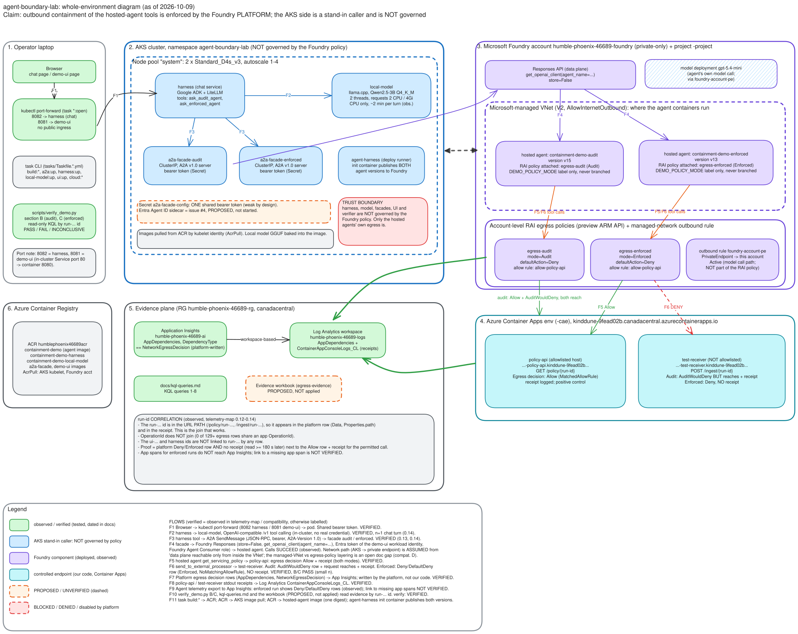

# Diagrams

The diagrams are a map of the environment, **not evidence**. Containment evidence is the platform decision rows plus
receipts for one `run-…` id; see [`../architecture-as-built.md`](../architecture-as-built.md) and
[`../kql-queries.md`](../kql-queries.md).

## Which diagram to use

| File | Use it for | Status |
| --- | --- | --- |
| [`environment.excalidraw`](environment.excalidraw) (source) and `environment.svg` (export) | **The current, whole system:** laptop, AKS pods, Foundry, Container Apps, evidence plane, ACR, with flows F1 to F11. Use this one. | Current (2026-10-09) |
| [`azure-environment.excalidraw`](azure-environment.excalidraw) / [`.svg`](azure-environment.svg) | Earlier Azure-resource-only view. Kept for history. | Superseded |

## Edit and export

1. Open `environment.excalidraw` in [excalidraw.com](https://excalidraw.com) (menu > *Open*; nothing is uploaded unless you share a link)
   or in VS Code with the *Excalidraw* extension (`pomdtr.excalidraw-editor`).
2. Edit. Arrows are bound to shapes and labels to their containers, so moving a box moves its arrows. Zoom to fit with Shift+1.
3. Export: *Export image* > SVG, with **Embed scene** ticked so the SVG stays editable, then save as `docs/diagrams/environment.svg`.
4. Commit the `.excalidraw` source and the `.svg` together. The source is authoritative; never edit the SVG by hand.

## How to read it

- **Zones** are the boxes: operator laptop, AKS namespace `agent-boundary-lab`, Foundry account and project, Container Apps
  (the two controlled endpoints), the evidence plane and ACR.
- **Arrows** carry a number `F1` to `F11`. The table below says what each one is and how sure we are.
- **Colour and line style** (below) tell you what is observed, what is not governed by the policy, and what is only proposed.

### Colour and line legend

| Style | Meaning |
| --- | --- |
| Green, solid | Observed / verified (dated evidence in `telemetry-map.md`, `compatibility.md`) |
| Blue, solid | AKS stand-in caller. **Not governed** by the Foundry policy. |
| Purple, solid | Foundry component (deployed, observed) |
| Teal, solid | Controlled endpoint (our code, Container Apps) |
| Orange, **dashed** | PROPOSED / UNVERIFIED (evidence workbook, Entra Agent ID, app-span link, F9) |
| Red | Blocked, denied or disabled by the platform (native A2A, enforced Deny) |

## The flows

| Flow | From to | What happens | Status |
| --- | --- | --- | --- |
| F1 | Browser to harness | `kubectl port-forward` to the chat service (`task harness:open`, local port 8082) | Verified |
| F2 | Harness to local model | OpenAI-compatible `/v1` call with tool calling to llama.cpp serving Qwen2.5-3B (CPU) | Verified |
| F3 | Harness tool to façade | One A2A `SendMessage` (bearer token, `A2A-Version: 1.0`) to the audit or the enforced façade | Verified |
| F4 | Façade to hosted agent | Foundry Responses call by agent name, Entra token, `store=False`. The AKS to private-account network path is **assumed** | Calls verified; path assumed |
| F5 | Hosted agent to policy-api | `get_servicing_policy`: host is on the allow list. Platform decision `Allow` and a receipt | Verified |
| F6 | Hosted agent to test-receiver | `send_to_external_processor`: host is **not** on the allow list. Audit: `AuditWouldDeny`, the call reaches it, receipt. Enforced: `Deny`, no receipt | Verified (small n) |
| F7 | Platform to App Insights | The platform writes one `NetworkEgressDecision` row per outbound call (`AppDependencies`) | Verified |
| F8 | Container Apps to Log Analytics | Receipts from policy-api and test-receiver (`ContainerAppConsoleLogs_CL`) | Verified |
| F9 | Hosted agent to App Insights | The agent's own telemetry export. Enforced: `Deny` / `DefaultDeny` (observed). That this is why enforced app spans never land is **not verified** | Observed; link unverified |
| F10 | Operator to evidence | `verify_demo.py` B and C, the KQL queries and the proposed workbook read the rows by `run-…` id | Script verified; workbook proposed |
| F11 | Builds | `task *:build` to ACR, then AKS pulls images and Foundry pulls the agent image | Verified |

Two things the arrows do not mean:

- **The harness, the model and the façades are not governed by the Foundry policy.** Only the hosted agents' outbound calls are.
- **The `run-…` id is the only join.** It travels in the URL path of the tool call. The `ui-…` and harness ids do not link to it.

## Verified vs proposed vs assumed

- **Verified:** F1 to F3, F5 to F8 and F10 (`verify_demo.py`), and the run-id join. See `telemetry-map.md` §0.12 to §0.14 (small n). The
  same image digest on both agents and the policy attachment were read back by the deployer.
- **Assumed:** the network path of F4. Calls succeed, but how the managed VNet and the egress policy layer is an open documentation gap
  (`compatibility.md` D). The model deployment name and the `foundry-account-pe` rule come from `infra/cloud` and B9g.
- **Proposed / unverified:** the evidence workbook (not applied), Entra Agent ID auth (issue #4), F9's link to missing app spans, and
  anything drawn dashed orange.
- **Blocked:** native inbound A2A on hosted agents (`HOSTED_AGENT_NOT_SUPPORTED`). The façades exist because of this.

Digests and version numbers drift. Re-read them with the `*:digest` tasks rather than trusting the diagram.
